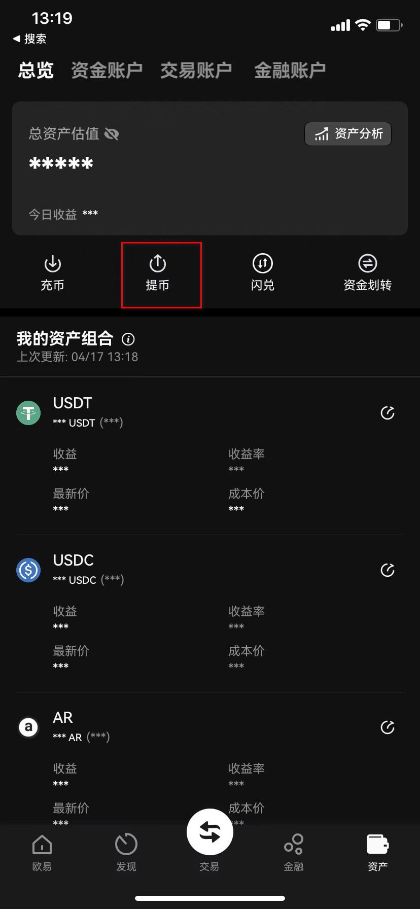
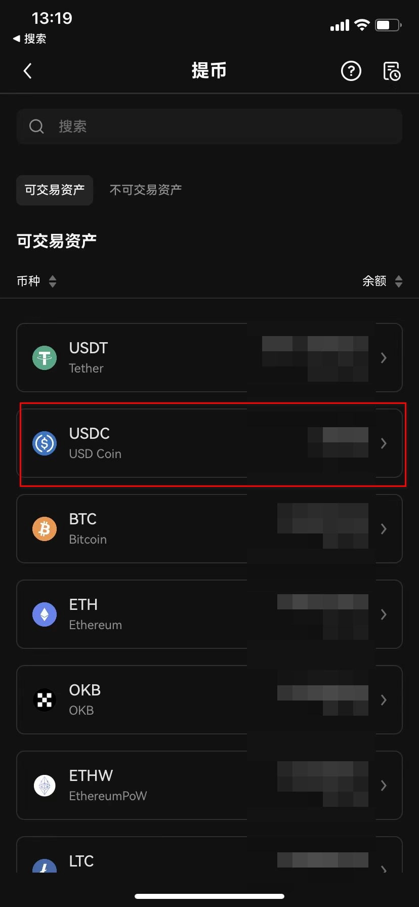
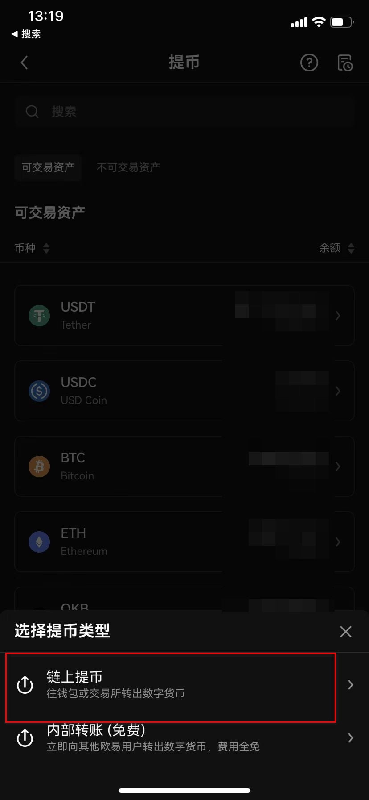
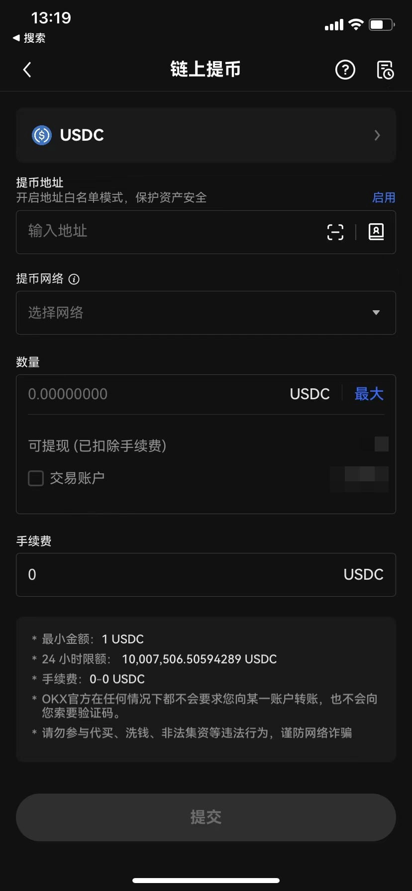
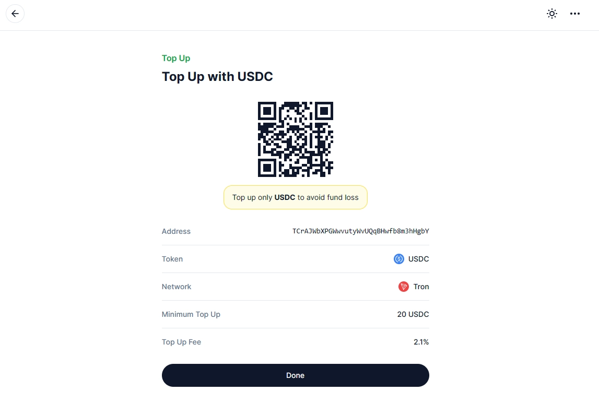
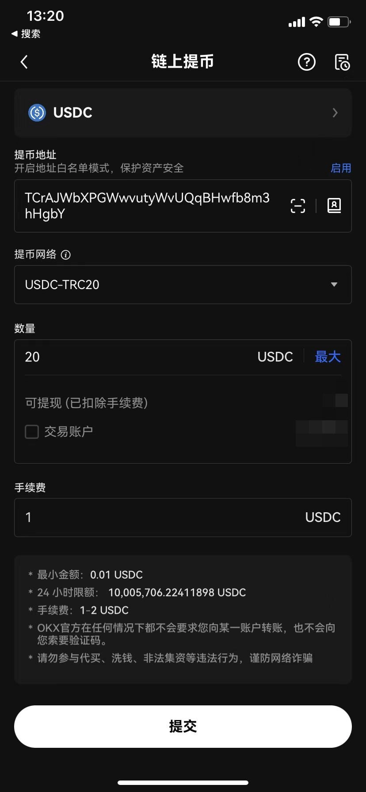
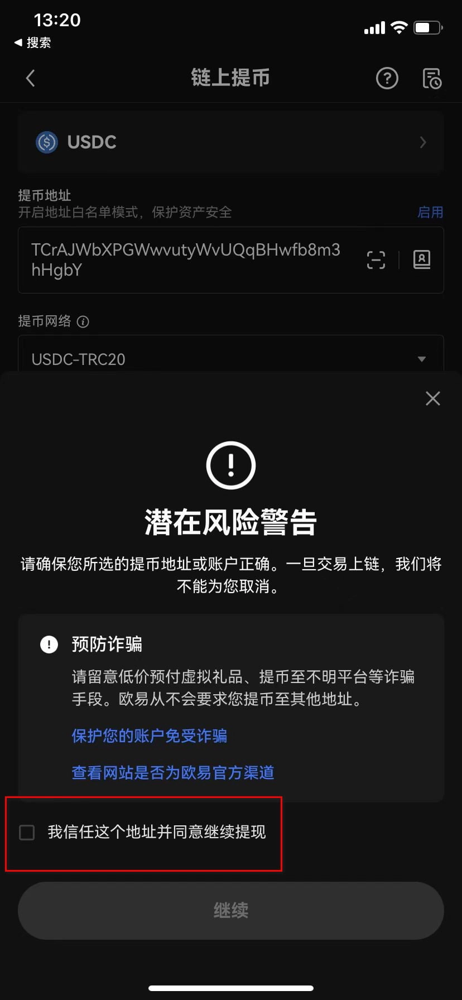
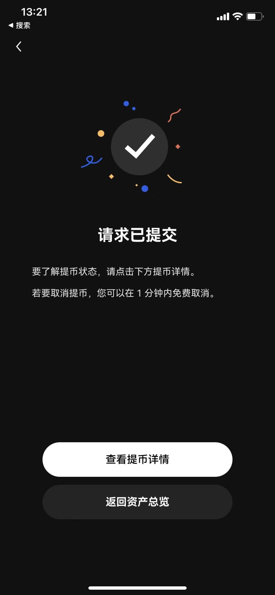

# How to Fund Your OneKey Card with USDC from OKX App

Registering a OneKey Card requires a minimum deposit of 20 USDC. This guide walks you through the simple process of transferring USDC from your OKX exchange account to your OneKey Card wallet. Whether you're setting up your first crypto card or topping up an existing one, this step-by-step tutorial shows you exactly how to complete the withdrawal safely and efficiently.

---

First things first—open your OKX app and log into your account. If you don't have an OKX account yet, you'll need to create one before proceeding.

Once you're logged in, head to the "Assets" page and tap on "Withdraw."

You'll see a list of available cryptocurrencies. Select "USDC" from the options.

Now choose your withdrawal type. For this operation, you'll want to select "On-chain Withdrawal."

Here's where you'll need your OneKey Card deposit address. You can either manually enter it or scan the QR code provided by OneKey Card.

The image below shows an example (but remember—you need to scan your own unique address, not someone else's):

Double-check that both the withdrawal address and network are correct. Enter the amount you want to withdraw, then hit the "Submit" button.

A warning prompt will pop up at this point.

👉 [Transfer USDC quickly and securely with minimal fees using OKX](https://www.okx.com/join/47044926)

Check the box that says "I trust this address and agree to continue with the withdrawal," then click "Continue."

And that's it! Now you just wait for OKX to process the withdrawal and for the funds to arrive in your OneKey Card account.

---

# Conclusion

Funding your OneKey Card with USDC from OKX is straightforward once you know the steps. The key is double-checking your withdrawal address and network before confirming the transaction. This process typically takes just a few minutes, making 👉 [OKX an ideal platform for quick and reliable crypto transfers to payment cards](https://www.okx.com/join/47044926). With your OneKey Card loaded up, you're ready to start using crypto for everyday purchases.
